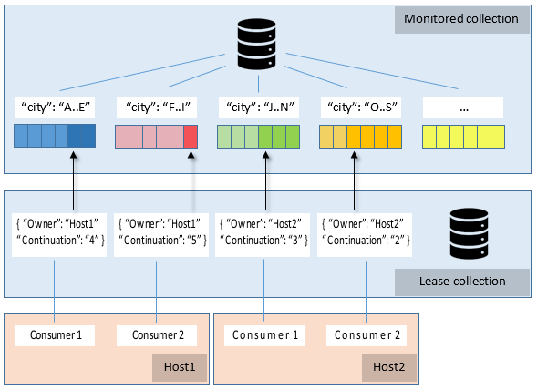

# Change Feed Processor library (v2)
This library helps distributing Azure Cosmos DB change feed events in partitioned collection across multiple observers. Instances of the processor can be scaled up (by adding) or down (by removing) dynamically, with partition load being automatically distributed among active instances in about-equal way.

## Releases
Change Feed Processor for .Net is released as NuGet package.
* Download the [NuGet package](https://www.nuget.org/packages/Microsoft.Azure.DocumentDB.ChangeFeedProcessor/).
* See [Release notes](https://docs.microsoft.com/azure/cosmos-db/sql-api-sdk-dotnet-changefeed).

## Design highlights
For illustration, let's assume we are processing the change feed from **Monitored collection**, which is partitioned by **city**. The arrows in the preceding diagram indicate the current position (continuation) in the change feed.



* For coordinating the processing of change feed across multiple workers, the leasing mechanism is used. To store leases, a separate collection (**Lease collection** in the diagram) is used.
    * There is one lease per partition.
    * Each lease in persisted as document in the Lease collection.
    * Lease has the following attributes: 
        * Owner: specifies the host that owns the lease (no owner - the lease is available). 
        * Continuation: specifies position (continuation token) in the change feed for particular partition.
        * Timestamp: last time the lease was updated.
        * Expiration interval: if a lease wasn't updated during this time it is considered expired and can be taken by other hosts.

* Each instance of the processor (IChangeFeedProcessor) does the following:
    * Determines how many partitions (leases) to own. This is based on how many other instances of the processor own active leases.
    * Acquires leases: starting with available leases, then expired leases, then steals leases from other processors if needed to fill up load-balancing target.
    * For each owned lease:
        * Renews the lease periodically. This is to make sure that lease expiration time is extended.
        * Reads change feed from the partition the lease is associated with.
        * Notifies the consumer (the observer, one per lease) with these changes.
        * After successful delivery notification, checkpoints last continuation token to its lease.
        * If lease is lost or stolen, notifies the observer.
    * For concurrency safety, for each lease update, ETag (if-match condition) is used. If it fails, the processor reads the lease document and checks whether it still owns it, and if not, the lease is considered lost.
    * On shutdown, releases all leases (sets Owner to null), but keeps the Continuation so that next time change feed for this partition will continue from last checkpoint.

* Scalability considerations
    * If one processor owns all leases, and another one comes up, the latter will start stealing leases from the former, so that eventually the leases will be about-equally divided between running hosts.
    * If a processor crashes, hangs or loses network connection, its leases will expire and will be distributes between other processors.

## Usage
### The workflow
- Implement Microsoft.Azure.Documents.ChangeFeedProcessor.FeedProcessing.IChangeFeedObserver and, if needed, IChangeFeedObserverFactory.
- Create DocumentCollectionInfo for monitored collection and lease collection.
- Create ChangeFeedProcessorBuilder and use its .With... methods to build desired configuration, then call .BuildAsync() method to build the processor instance.
- Call processor.StartAsync().
- When done, call processor.StopAsync().

### Example
```csharp
// Observer.cs
namespace Sample
{
    using System;
    using System.Collections.Generic;
    using System.Threading;
    using System.Threading.Tasks;
    using Microsoft.Azure.Documents;
    using Microsoft.Azure.Documents.ChangeFeedProcessor.FeedProcessing;

    class SampleObserver : IChangeFeedObserver
    {
        public Task CloseAsync(IChangeFeedObserverContext context, ChangeFeedObserverCloseReason reason)
        {
            return Task.CompletedTask;  // Note: requires targeting .Net 4.6+.
        }

        public Task OpenAsync(IChangeFeedObserverContext context)
        {
             return Task.CompletedTask;
        }

        public Task ProcessChangesAsync(IChangeFeedObserverContext context, IReadOnlyList<Document> docs, CancellationToken cancellationToken)
        {
            Console.WriteLine("ProcessChangesAsync: partition {0}, {1} docs", context.PartitionKeyRangeId, docs.Count);
            return Task.CompletedTask;
        }
    }
}

// Main.cs
namespace Sample
{
    using System;
    using System.Threading.Tasks;
    using Microsoft.Azure.Documents.ChangeFeedProcessor;
    using Microsoft.Azure.Documents.ChangeFeedProcessor.Logging;

    class ChangeFeedProcessorSample
    {
        public static void Run()
        {
            RunAsync().Wait();
        }

        static async Task RunAsync()
        {
            DocumentCollectionInfo feedCollectionInfo = new DocumentCollectionInfo()
            {
                DatabaseName = "DatabaseName",
                CollectionName = "MonitoredCollectionName",
                Uri = new Uri("https://sampleservice.documents.azure.com:443/"),
                MasterKey = "-- the auth key"
            };

            DocumentCollectionInfo leaseCollectionInfo = new DocumentCollectionInfo()
            {
                DatabaseName = "DatabaseName",
                CollectionName = "leases",
                Uri = new Uri("https://sampleservice.documents.azure.com:443/"),
                MasterKey = "-- the auth key"
            };

            var builder = new ChangeFeedProcessorBuilder();
            var processor = await builder
                .WithHostName("SampleHost")
                .WithFeedCollection(feedCollectionInfo)
                .WithLeaseCollection(leaseCollectionInfo)
                .WithObserver<SampleObserver>()
                .BuildAsync();

            await processor.StartAsync();

            Console.WriteLine("Change Feed Processor started. Press <Enter> key to stop...");
            Console.ReadLine();

            await processor.StopAsync();
        }
    }
}
```
## Note on obsolete API
The following v1 API from v1 is is present in v2 for backward compatibility but is marked obsolete. It is recommended to use new API.

- Microsoft.Azure.Documents.ChangeFeedProcessor.ChangeFeedEventHost.<br/> Use Microsoft.Azure.Documents.ChangeFeedProcessor.ChangeFeedProcessorBuilder.
- Microsoft.Azure.Documents.ChangeFeedProcessor.ChangeFeedHostOptions.<br/> Use Microsoft.Azure.Documents.ChangeFeedProcessor.ChangeFeedProcessorOptions. Note that ChangeFeedProcessorBuilder does not take ChangeFeedOptions, use ChangeFeedProcessorOptions to provide ChangeFeedOptions-related parameters.
- Microsoft.Azure.Documents.ChangeFeedProcessor.ChangeFeedObserverContext.<br/> Use Microsoft.Azure.Documents.ChangeFeedProcessor.FeedProcessing.IChangeFeedObserverContext that has ProcessChangesAsync taking new CancellationToken parameter.
- Microsoft.Azure.Documents.ChangeFeedProcessor.ChangeFeedObserverCloseReason.<br/> Use Microsoft.Azure.Documents.ChangeFeedProcessor.FeedProcessing.ChangeFeedObserverCloseReason.
- Microsoft.Azure.Documents.ChangeFeedProcessor.IChangeFeedObserver.<br/> Use Microsoft.Azure.Documents.ChangeFeedProcessor.FeedProcessing.IChangeFeedObserver.
- Microsoft.Azure.Documents.ChangeFeedProcessor.IChangeFeedObserverFactory.<br/> Use Microsoft.Azure.Documents.ChangeFeedProcessor.FeedProcessing.IChangeFeedObserverFactory.

## Troubleshooting
### How to enable tracing
Change Feed Processor library is using [LibLog](https://github.com/damianh/LibLog) and supports a few log providers out of the box. 

Log provider for .Net tracing is provided by the library and needs to be enabled. 
Follow steps below to enable **.Net tracing**:

- When using obsolete (v1) API<br/>
Just use <system.configuration> section provided below.

- When using current (v2) API
1) Add the following code to your project:
```csharp
using Microsoft.Azure.Documents.ChangeFeedProcessor.Logging;

var hostName = "SampleHost";
var tracelogProvider = new TraceLogProvider();
using (tracelogProvider.OpenNestedContext(hostName))
{
    LogProvider.SetCurrentLogProvider(tracelogProvider);
    // After this, create IChangeFeedProcessor instance and start/stop it.
}
```
2) Do one of the following:

- To configure tracing using `app.config` file, add the following <system.configuration> section in your `app.config`:

```xml
  <system.diagnostics>
    <sharedListeners>
      <add name="file" type="System.Diagnostics.TextWriterTraceListener" initializeData="C:\ChangeFeedProcessorTrace.log" />
    </sharedListeners>
    <sources>
      <source name="ChangeFeedEventHost" switchType="System.Diagnostics.SourceSwitch" switchValue="Information">
        <!-- All, Verbose, Warning, Information, Error, Off -->
        <listeners>
          <clear />
          <add name="file" />
        </listeners>
      </source>
    </sources>
    <trace autoflush="true" useGlobalLock="false" />
  </system.diagnostics>
```

- To configure tracing programmatically (supported in [v2.5.0](https://learn.microsoft.com/en-us/azure/cosmos-db/nosql/sdk-dotnet-change-feed-v2#2.5.0) and later versions), use the following code:
```csharp
using System.Diagnostics;
using Microsoft.Azure.Documents.ChangeFeedProcessor.Logging;

using (var writer = new StreamWriter(@"C:\ChangeFeedProcessorTrace.log") { AutoFlush = true })
{
    // Create custom TraceSource.
    var traceSource = new TraceSource("Change Feed Processor", SourceLevels.All);
    traceSource.Listeners.Clear();
    traceSource.Listeners.Add(new TextWriterTraceListener(writer));

    // Create TraceLogProvider from TraceSource.
    var tracelogProvider = new TraceLogProvider(traceSource);

    // Continue using TraceLogProvider in the same way as code snippet above.
    var hostName = "SampleHost";
    using (tracelogProvider.OpenNestedContext(hostName))
    {
        LogProvider.SetCurrentLogProvider(tracelogProvider);
        // After this, create IChangeFeedProcessor instance and start/stop it.
    }
}
```

## See also
* [Working with the change feed support in Azure Cosmos DB](https://docs.microsoft.com/azure/cosmos-db/change-feed)
* [Previous version (v1) repository](https://github.com/Azure/azure-documentdb-dotnet/tree/master/samples/ChangeFeedProcessor).

# Contributing

This project welcomes contributions and suggestions.  Most contributions require you to agree to a
Contributor License Agreement (CLA) declaring that you have the right to, and actually do, grant us
the rights to use your contribution. For details, visit https://cla.microsoft.com.

When you submit a pull request, a CLA-bot will automatically determine whether you need to provide
a CLA and decorate the PR appropriately (e.g., label, comment). Simply follow the instructions
provided by the bot. You will only need to do this once across all repos using our CLA.

This project has adopted the [Microsoft Open Source Code of Conduct](https://opensource.microsoft.com/codeofconduct/).
For more information see the [Code of Conduct FAQ](https://opensource.microsoft.com/codeofconduct/faq/) or
contact [opencode@microsoft.com](mailto:opencode@microsoft.com) with any additional questions or comments.
